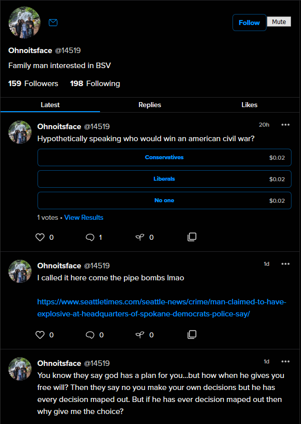
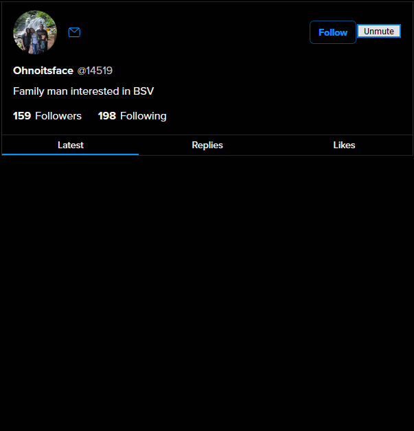
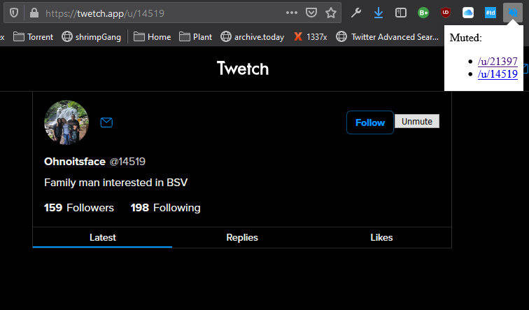

# Twetch Mute
10 BSV? Chillllllll bro

## About
mute annoying people on [Twetch](http://twetch.app)

## Donate (less than 10 BSV)
- paymail: prestonbrown@moneybutton.com
- bitcoin (BSV): 1AYdJbmkQTXR7eBmGbYGSfzHoz4RfBysUD

## Why?
I made this Firefox extension because I'm tired of no mute feature. It is really poorly made. You get what you pay for. BUT. Gimme clout and donations.

## How?
1. visit annoying page 
2. mute user 
3. their posts will now be hidden site-wide
4. there is a list of everyone you have muted as browser popup 
5. to unmute user (why?) just go back to page and click the unmute button

## Contribute
I have very little experience with creating browser extensions. This is a work in progress that anyone can contribute to.

## FAQ
1. No chrome?
   - no. chrome needs to get it together and use promises like firefox provides with ```browser```